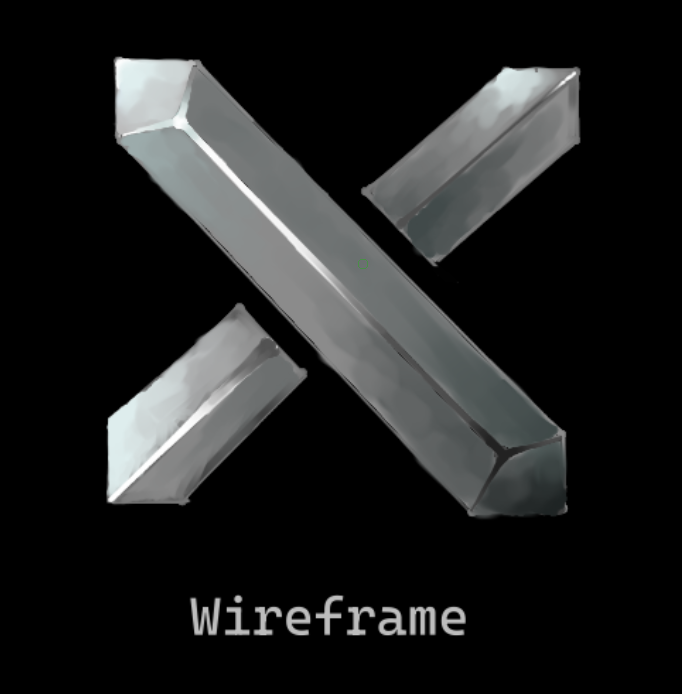

  
# Wireframe (This is just the library part, which is why this repo is called JustWireframe)

### A powerful 0 cost no GUI game engine that provides control and speed to the programmer, while also providing ease of use. (similar to LWJGL)

Compile this with CMake. (This comes with a demo of how to use this in Example, for which you'll have to drag the files from the Audio subdirectory next to the generated executable, and drag the files from the Shaders subdirectory next to the generated executable.

This project relies on:  
EzAL: https://github.com/RandomGamingDev/EzAL  
EzGL: https://github.com/RandomGamingDev/EzGL

To see the dependencies just click the links!

Just like the EzAL, and EzGL, I'd be glad to accept additions to Wireframe to improve the library since I want to support more libraries, APIs, platforms, and more, and generally improve this project.
